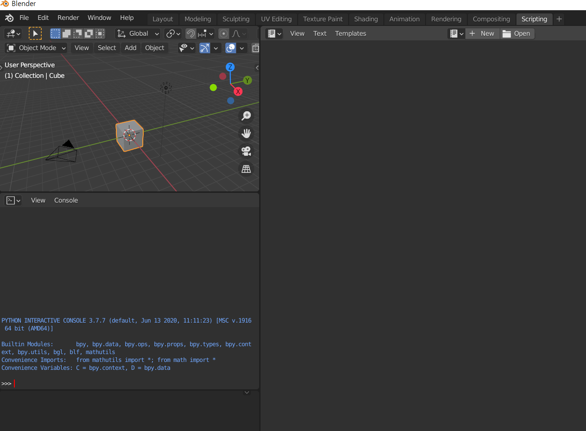
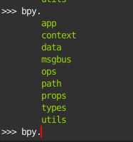

# [Python으로 블렌더 사용]

블렌더에서는 python을 통한 스크립팅 기능을 지원한다.

이를 통해 블렌더에서 마우스나 키보드로 진행하던 동작을 파이썬 코드를 통해 진행할 수 있다.  

 
 

bpy, bgl, blf, mathutils 등의 모듈이 포함되어있다.

blender의 데이터는 blend-file 에 저장되며,

그 파일의 data에 접근하려면 bpy.data 모듈을 사용해야한다.  

 
 

명령문을 입력하다가 Tab을 누르면 auto-complete기능을 사용할 수 있다.

선택항목이 여럿이라면 선택 가능한 항목의 목록이 출력된다.  

 
 

## [원하는 작업의 코드 확인하기]

- 방법 1

원하는 작업의 코드를 확인하기 위해서는 Edit→Preferences 에서

Developer Extras, Tooltips, Python Tooltips 를 모두 체크 하면 확인할 수 있다.  

 
 

해당 설정이 완료되면, 메뉴에서 선택한 기능의 코드를 확인할 수 있다.

예를 들어 fbx파일로 export 하려고 한다면 위의 코드를 통해 해당 과정을 진행할 수 있다.  

 
 

- 방법 2

원하는 작업을 진행한 후 Info 편집기를 확인한다.

Info 편집기에는 작업한 내용이 코드형태로 기록되고,

해당 코드를 입력하면 내가 작업한 내용과 똑같은 작업이 진행된다.

예시로 오브젝트를 (1,1,1) 으로 옮겨보았다.  

 
 

## [속성편집기 갱신]

스크립트를 통해 설정값을 변경하더라도 속성편집기 화면에 바로 반영되지 않는다.

마우스를 속성편집기 위로 가져다 놓으면 자동으로 갱신된다.

### [참고링크]

- [[블렌더/파이썬] 시작하기 ~ [블렌더/파이썬] 나만의 기능을 만들자 - 오퍼레이터](https://www.youtube.com/playlist?list=PLMMbr17RbOxVWRRvIuGTQMq6mJEvM6Oez)