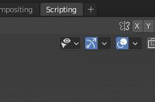
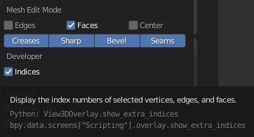

# vertex의 ID 표시하기

- 해당 아래쪽 화살표 3개를 찾는다.
- 3번째에 위치한 화살표를 누르면 새로운 옵션 창이 열린다.

- 아래에 Mesh Edit Mode에 대한 옵션이 제공된다.
- Developer - Indices를 체크 하면 된다.
- 해당 python 코드 또한 같이 제공한다.

## 참고링크

- [https://dataprocess.tistory.com/516](https://dataprocess.tistory.com/516)
- [https://blender.stackexchange.com/questions/3249/show-mesh-vertices-id](https://blender.stackexchange.com/questions/3249/show-mesh-vertices-id)