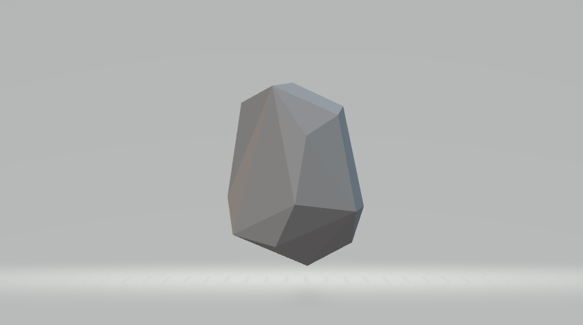
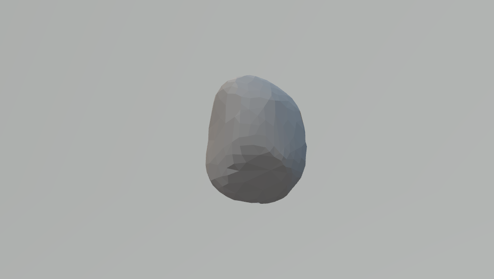
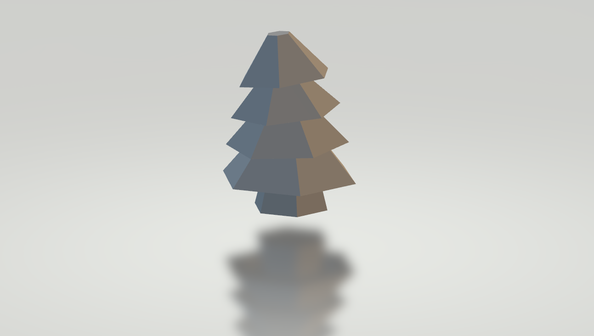

# OSS Project

## 프로젝트 소개

### Blender를 이용한 오브젝트 자동 생성 프로그램

### 기획의도
- 개발을 하는 과정에서 다양한 3D오브젝트들이 필요할 때가 있습니다.

- 일부 오브젝트들은 비슷하게 생겼지만 조금씩 다른 모양으로 제작해야 합니다.
  - ex) 나무, 돌 등은 그 생김새는 비슷하지만 조금씩 다른 모습을 하고있습니다.

- 따라서 원하는 오브젝트를 랜덤한 모습의 fbx파일로 생성하여 사용할 수 있도록 하는 프로그램을 개발하고자 하였습니다.

### 기능
- 다음 3가지 옵션을 선택하여 원하는 수 만큼 생성할 수 있습니다.
  - rock (low poly)
  - rock
  - tree (low poly)

### 결과물
- [Project 디렉토리](https://github.com/oeccsy/OSS_Project/tree/main/Project)에서 프로그램을 확인하실 수 있습니다.
  - 프로그램을 확인하기 전에 아래 주의사항도 읽어주세요.
  - 프로그램이 실행되면 생성되는 fbx파일은 [Output 디렉토리](https://github.com/oeccsy/OSS_Project/tree/main/Project/Output)의 경로에 생성됩니다.

- 아래는 해당 프로그램을 통해 얻을 수 있는 fbx 파일 입니다.

- Project의 [Sample 디렉토리](https://github.com/oeccsy/OSS_Project/tree/main/Project/Sample)에서도 확인할 수 있습니다.

- 차례로 rock(low poly), rock, tree(low poly) 순 입니다.

## 주의 사항
- python 3.7 에서 동작해야 합니다. (이외에는 bpy가 동작하지 않음)

- bpy module이 설치 되어야 합니다.
  - 또는 Blender 프로그램 내부의 scripting 탭에서 직접 실행시킬 수 있습니다.
  - bpy module은 `pip install bpy` 명령어를 통해 설치할 수 있습니다.

- bpy module 설치 이후에도 실행할 수 없는 경우 [여기](https://github.com/oeccsy/OSS_Project/blob/main/ETC/Summary/bpy%EB%AA%A8%EB%93%88%20%EC%98%A4%EB%A5%98%20%ED%95%B4%EA%B2%B0%ED%95%98%EA%B8%B0.MD)를 확인해주세요
  - `No module named 'bpy_types'` 의 오류가 발생할 수 있음

  - 해당 repository를 clone 하지 않고 실행하는 경우,
    - 프로그램 실행 시 파일 경로에 Output 디렉토리가 존재해야 합니다.

### 라이센스
- Blender는 GNU GPL v2 라이센스의 오픈소스입니다.

- 이 프로젝트는 이와 동일한 GNU GPL v2 라이센스를 적용합니다.

### 참고자료
- ETC의 [Summary디렉토리](https://github.com/oeccsy/OSS_Project/tree/main/ETC/Summary)에서 프로그램을 개발하기 위해 정리한 내용과 참고하였던 자료를 확인하실 수 있습니다.

